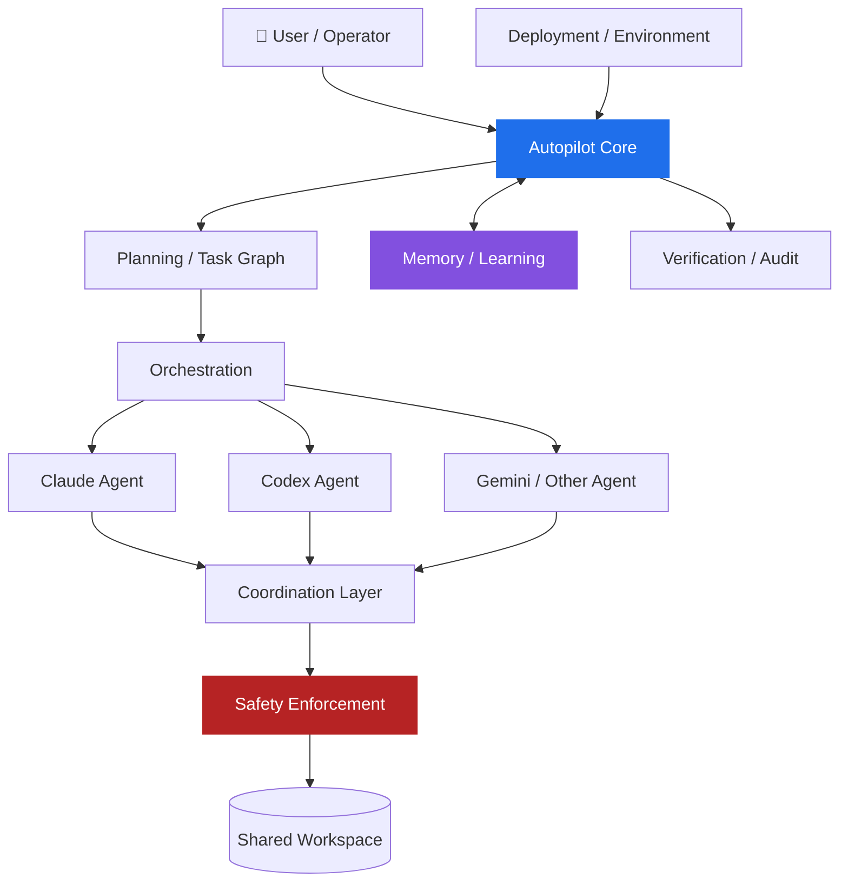

<div align="center">

# 🚀 Autopilot Flywheel

### From a single coding agent to a governed, multi-agent software factory

**Мультиагентная самообучающаяся платформа для автономной разработки ПО.**  
Эволюция [autopilot-jet](https://github.com/Alpha-Oi/autopilot-jet) в сторону координируемой, проверяемой и безопасной агентной системы.

<p>
  
  
  
</p>

<p>
  <a href="docs/VISION.md"><strong>Vision</strong></a> ·
  <a href="docs/ARCHITECTURE.md"><strong>Architecture</strong></a> ·
  <a href="docs/ROADMAP.md"><strong>Roadmap</strong></a> ·
  <a href="docs/VERIFICATION.md"><strong>Verification</strong></a> ·
  <a href="CONTRIBUTING.md"><strong>Contributing</strong></a>
</p>

> **Current state:** DESIGN / FOUNDATION  
> Архитектура заложена. Реальные внешние интерфейсы проходят evidence-first верификацию до начала production-интеграции.

</div>

---

## ✨ Идея в одном абзаце

Autopilot Flywheel проектируется как слой управления над несколькими AI coding agents. Пользователь задаёт цель, система превращает её в спецификацию и граф задач, распределяет работу между агентами, координирует доступ к общей кодовой базе, блокирует опасные действия, проверяет результат и сохраняет проверенный опыт для следующих запусков.

Ключевая идея — не просто **автоматизировать один запуск**, а создать **маховик накопления инженерного опыта**:

```text
задачи → проверенные outcomes → полезная память → более сильный контекст
   ↑                                                   ↓
   └────────────── более эффективные новые задачи ─────┘
```

---

## 🎯 Что должен дать Flywheel

| Capability | Зачем |
|---|---|
| 🧭 **Planning** | Превращать спецификацию в dependency-aware task graph |
| 🧠 **Memory** | Переиспользовать только проверенный опыт с provenance и confidence |
| 🕸️ **Multi-agent orchestration** | Выполнять независимые задачи параллельно |
| 📬 **Coordination** | Не допускать silent overwrite и конфликтов между агентами |
| 🛡️ **Runtime safety** | Блокировать destructive/high-risk actions до выполнения |
| 🔍 **Verification** | Сравнивать результат с acceptance criteria и evidence |
| 📜 **Auditability** | Отвечать на вопрос «кто, что, когда и почему сделал» |
| ⚙️ **Reproducibility** | Воспроизводимо поднимать совместимую агентную среду |

---

## 🏗️ Целевая архитектура



### Главный архитектурный принцип

```text
Autopilot Core
      ↓
Internal Capability Contract
      ↓
Adapter
      ↓
External Tool
```

Flywheel не должен «врастать» в конкретный внешний инструмент. Кандидат может быть заменён, если сохраняется внутренний capability contract.

Подробнее: **[docs/ARCHITECTURE.md](docs/ARCHITECTURE.md)**.

---

## 🧩 Кандидаты интеграционного стека

> Ни один пункт ниже не считается production-контрактом, пока не прошёл [verification protocol](docs/VERIFICATION.md).

| Capability | Candidate | Status |
|---|---|:---:|
| Planning transform | [beads-workflow](https://github.com/Dicklesworthstone/beads-workflow) | 🟡 PROPOSED |
| Graph analysis | [beads_viewer](https://github.com/Dicklesworthstone/beads_viewer) | 🟡 PROPOSED |
| Orchestration | [named_tmux_manager](https://github.com/Dicklesworthstone/named_tmux_manager) | 🟡 PROPOSED |
| Coordination / leases | [mcp_agent_mail](https://github.com/Dicklesworthstone/mcp_agent_mail) | 🟡 PROPOSED |
| Destructive action guard | [destructive_command_guard](https://github.com/Dicklesworthstone/destructive_command_guard) | 🟡 PROPOSED |
| Session search | [coding_agent_session_search](https://github.com/Dicklesworthstone/coding_agent_session_search) | 🟡 PROPOSED |
| Procedural memory | [cass_memory_system](https://github.com/Dicklesworthstone/cass_memory_system) | 🟡 PROPOSED |
| Environment setup | [agentic_coding_flywheel_setup](https://github.com/Dicklesworthstone/agentic_coding_flywheel_setup) | 🟡 PROPOSED |

Полный реестр: **[docs/INTERFACES.md](docs/INTERFACES.md)**.

---

## 🛡️ Принципы проекта

### Verify before integrate
Внешний CLI, MCP tool, REST route, schema или port не становится контрактом только потому, что он встретился в README, issue или старой заметке.

### Safety fails closed
Если обязательный защитный слой недоступен, high-risk действие не становится автоматически разрешённым.

### Adapter-first
Vendor-specific интерфейсы остаются на границе adapter layer, а не распространяются по Core.

### Auditable execution
Планирование, делегирование, изменения, approvals, проверки и outcomes должны иметь traceable identity.

### Idempotent orchestration
Повторный запуск не должен дублировать задачи, повторно применять один patch или разрушать состояние.

### Human authority
Высокорисковые и необратимые действия остаются под явной политикой разрешений.

### Evidence-based learning
Память хранит provenance/confidence и должна поддерживать подтверждение, понижение confidence, supersession и invalidation.

---

## 🔄 Как должен выглядеть один run

```text
01  User intent
      ↓
02  Specification
      ↓
03  Task graph
      ↓
04  Relevant memory/context
      ↓
05  Scheduling
      ↓
06  Agent assignment + coordination
      ↓
07  Safety preflight
      ↓
08  Execution
      ↓
09  Verification
      ↓
10  Outcome + audit
      ↓
11  Memory feedback
```

---

## 🗺️ Roadmap

| Phase | Цель | Статус |
|---|---|:---:|
| **0 — Foundation & Verification** | Vision, architecture, governance, подтверждение реальных interfaces | 🟠 CURRENT |
| **1 — Core Contracts & Safety** | Single-agent lifecycle, adapters, audit, safety boundary | ⚪ PLANNED |
| **2 — Memory** | Retrieval, provenance, feedback, invalidation | ⚪ PLANNED |
| **3 — Planning Graph** | Dependency-aware task execution | ⚪ PLANNED |
| **4 — Orchestration** | Managed agent sessions, recovery, concurrency | ⚪ PLANNED |
| **5 — Multi-Agent Coordination** | Identity, leases, conflicts, parallel writes | ⚪ PLANNED |
| **6 — Deployment** | Reproducible environment and rollback | ⚪ PLANNED |
| **7 — Productization** | Operator UX, benchmarks, v1.0 criteria | ⚪ PLANNED |

Полный roadmap и exit criteria: **[docs/ROADMAP.md](docs/ROADMAP.md)**.

---

## 🚦 Что уже есть

- [x] Detailed product vision
- [x] Architecture foundation
- [x] Agent governance rules
- [x] Integration registry
- [x] Verification protocol
- [x] ADR process
- [x] Contribution workflow
- [x] GitHub issue / PR workflow
- [ ] Stable `autopilot-jet` baseline pinned
- [ ] Candidate integrations verified
- [ ] Compatibility matrix completed
- [ ] First vertical slice selected
- [ ] Production implementation

---

## 📚 Документация

| Документ | Что внутри |
|---|---|
| **[Vision](docs/VISION.md)** | Полная продуктовая идея, мотивация, сценарии, риски и целевые метрики |
| **[Architecture](docs/ARCHITECTURE.md)** | Слои, control plane, invariants, failure modes, adapter boundaries |
| **[Interfaces](docs/INTERFACES.md)** | Статусы внешних интеграций и proposed internal contracts |
| **[Verification](docs/VERIFICATION.md)** | Как внешний интерфейс получает статус VERIFIED |
| **[Roadmap](docs/ROADMAP.md)** | Фазы, deliverables и exit criteria |
| **[ADR](docs/adr/README.md)** | Architecture Decision Records |
| **[Agent Rules](AGENTS.md)** | Правила для Codex, Claude Code и других coding agents |
| **[Contributing](CONTRIBUTING.md)** | Как предлагать изменения и интеграции |
| **[Security](SECURITY.md)** | Как сообщать о проблемах безопасности |

Оглавление docs: **[docs/README.md](docs/README.md)**.

---

## 🤝 Как участвовать

Сейчас особенно полезны:

- verification реальных upstream interfaces;
- architecture review;
- compatibility research;
- safety / threat-model review;
- contract tests;
- ADR;
- документация и benchmark methodology.

Перед вкладом прочитайте **[CONTRIBUTING.md](CONTRIBUTING.md)** и **[AGENTS.md](AGENTS.md)**.

---

## 🔬 Важное ограничение текущей стадии

Autopilot Flywheel **ещё не является готовой автономной платформой**.

Сейчас репозиторий фиксирует архитектуру и правила, по которым она будет реализовываться. Заявленные target-метрики из Vision — например ускорение относительно одиночного агента — являются **целями для будущих benchmark**, а не достигнутыми результатами.

Такой подход намеренный: сначала проверяем интерфейсы и safety assumptions, затем строим код.

---

## 🙏 Благодарности

Идея Flywheel опирается на опыт существующей экосистемы AI coding tools и открытых проектов:

- [Nick Vels / skills](https://github.com/nick-vels/skills)
- [Dicklesworthstone ecosystem](https://github.com/Dicklesworthstone)
- [Anthropic Claude Code](https://www.anthropic.com/)
- [OpenAI Codex](https://openai.com/)
- [Google Gemini](https://gemini.google.com/)

Упоминание проекта или продукта здесь не означает официальную аффилиацию или endorsement.

---

<div align="center">

### 🌀 Autopilot Flywheel

**Plan → Coordinate → Execute → Verify → Learn → Repeat**

[Vision](docs/VISION.md) · [Architecture](docs/ARCHITECTURE.md) · [Roadmap](docs/ROADMAP.md) · [Contributing](CONTRIBUTING.md)

MIT © 2026 Alpha-Oi

</div>
